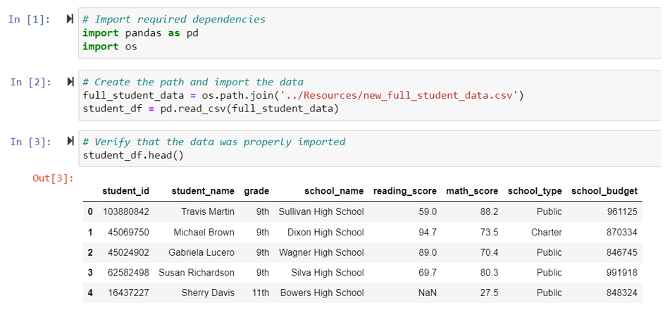
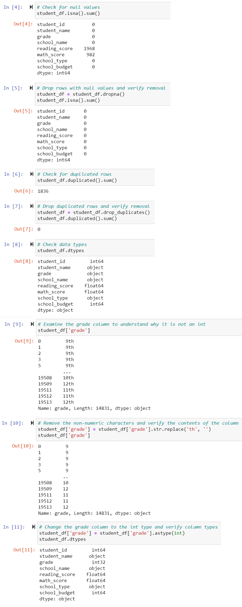
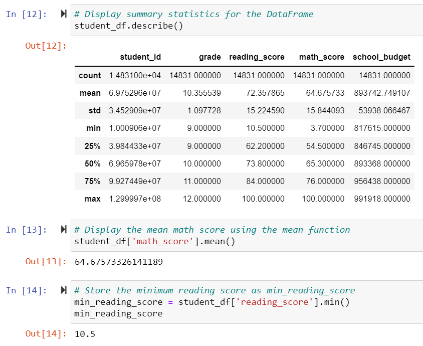
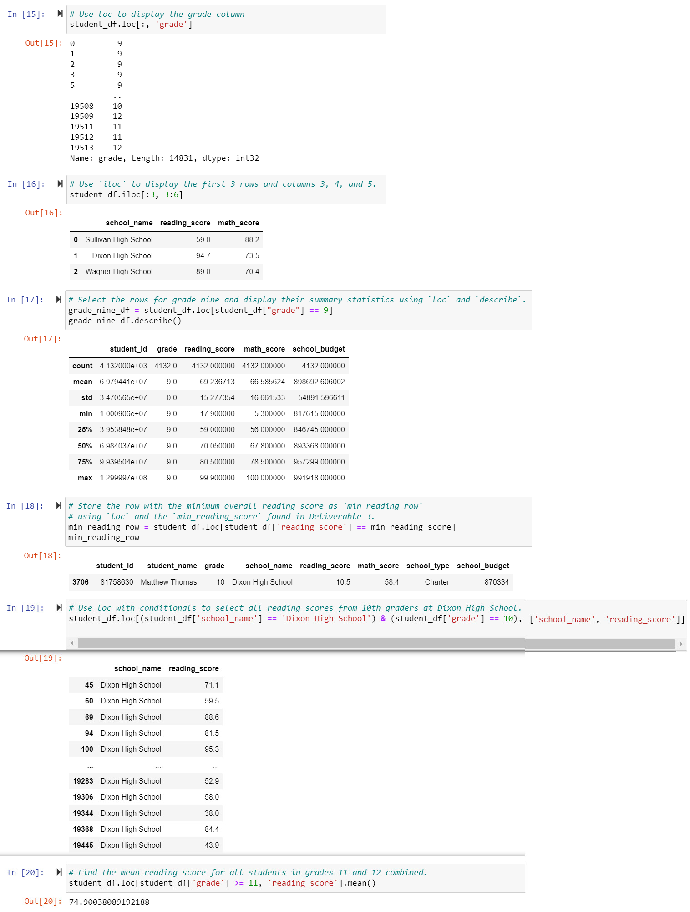
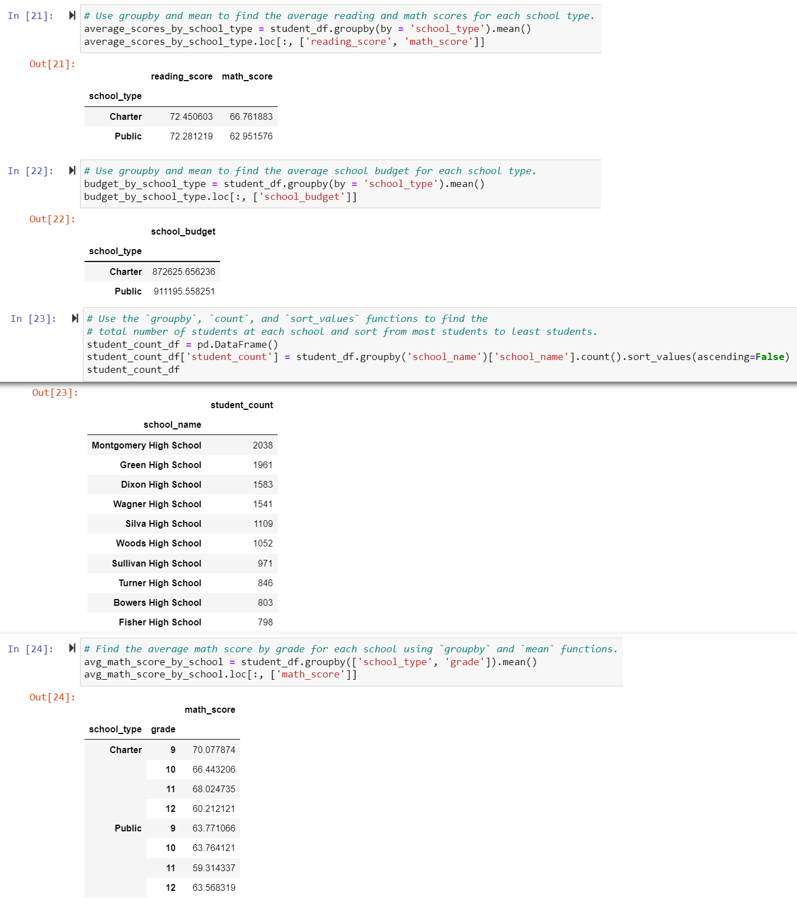

# School_District_Analysis

## Overview of School District Analysis
We were tasked with helping Maria complete an analysis on standardized test performance across an entire school district in order to uncover insights on trends and patterns. For this task we will look at students' test scores for math and reading as the school information those students attend using pandas and jupyter notebook.

## School District Analysis Process
**Collecting the Data**

The first part of the process is collecting the data in jupyter notebook. We did this by importing the csv Maria provided us using os.path.join and then using the pandas read_csv function and creating a DataFrame called student_df. We check this by then running student_df.head to get a preview of the first 5 rows to get the below DataFrame Preview.

**Preparing the Data**

In order to prepare the data for analysis we first checked for missing/null values using the sum of the isna function and found reading_score and math_score had some missing values. We removed all of these rows, as well as the duplicate rows using the dropna and drop_duplicates functions. We then checked our data types by using dtypes. After that check we noticed we needed to remove the “th” in all the grades and make grades an integer data type. This was done by using the str.replace function to remove the “th” and then use .astype(int) in order to make grade an integer data type.

**Summarizing the Data**

During the summary of the data we looked at the bigger picture across the entire dataset. We pulled the summary statistics using the describe function. We also pulled the mean math score using the mean function and then pulled the minimum reading score using the min function.

**Drilling Down into the Data**

We then drilled down into some of the data. First we displayed the grade column using loc and then displayed a preview of the school name, math score, and reading score across the first 3 rows using iloc.

The next piece we looked at was pulling the summary statistics for all students in grade 9 using loc and describe. We also extracted the entire row of information for the student with the lowest reading score by creating a new variable and using loc to find the lowest reading score we set in the summary of the data section. We then used loc and conditionals to pull the reading score of every student in grade 10 at Dixon High School using an AND conditional. The last drill down we did was to look at the mean reading score for all students in grades 11 and 12 using loc for students with grade greater than or equal to 11.

**Comparing the Data**

Now we will compare some of the data. For this we used the groupby function. According to the assignment starter code the first comparison was to display average reading and math score per school type and the first comparison in the module challenge said to compare the school budget across school type. Both of these are done by using the mean function with the groupby.

The second comparison was to look at the total number of students across each school in descending order. This was done using the groupby, count, and sort_values functions looking at each row’s school_name in the dataset.

The last comparison we were asked to do was find the average math score by grade across each school type. This is done by creating a new variable using the groupby for both school type and grades and mean function.

## School District Analysis Results
When removing null values from the analysis we removed 10% of students who didn't have Reading Scores and 5% that didn't have Math Scores. Looking into the data that made the analysis we saw overall students performed worse in reading vs. math. We see this through the average math score (64) being 8 percent lower than the average reading score (72), and the minimum scores and 25th percentile scores also lower for math in comparison to reading. Doing the deep dive into 9th grade we see the mean for reading is lower at 69, than the mean ran later for grades 11 and 12 combined at 74. Public schools have a higher budget on average but are slightly worse performers in math compared to charter schools. Both school types did however have roughly the same mean reading score at 72, this could mean school type might impact math more than reading. Lastly public schools were more consistent across math scores per grade with (63, 63, 59, 63) though relatively low compared to charter schools where they were slightly more sporadic but higher performing (70, 66, 68, 60).

## School District Analysis Summary
This given analysis scratched the surface of the details we could look into in order to create and implement strategies to address findings within this analysis. However, this analysis did provide some peaks into what should be further drilled down into in order to extract strong findings. For example, the amount of missing reading scores could be somewhat concerning seeing as how 10% of all students didn't have one, though we would still remove these for analysis, we might want to take a look at if these were certain schools or school types that could impact our count/size analysis. 

Within the data drill down section we should expand on the average math and reading scores per school in order to see if certain schools stood out as top performers or bottom performers. We should then look into the best and worst performers to see if there are any trends that stand out like low budget, many students, even types. Given the difference in mean scores by grade for math, we should also look at this for reading, especially given the deep dive of 9th grade showing a way lower average reading score (69) vs. the combined 11th and 12th grade average reading score (74). There is likely a difference in reading performance between the different grades. Once determining potential impact from grades on scores, we should also look at the student count and how it relates with budget across school types. This could help determine if budget or student counts could influence the difference in math performance. We could also compare the student count per grade to determine if that relates to the scores and drill down to count per grade per type in order to see if there's a trend with grade size and the difference in math score we saw in our beginning analysis.
